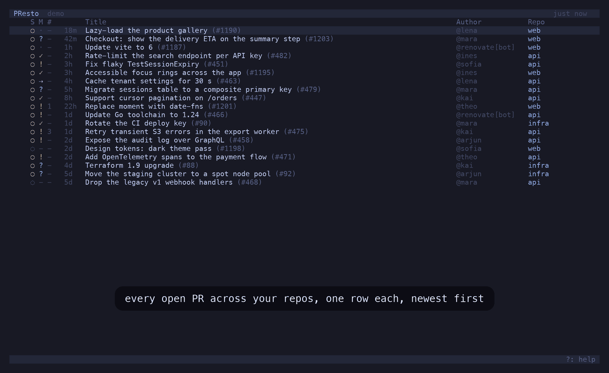
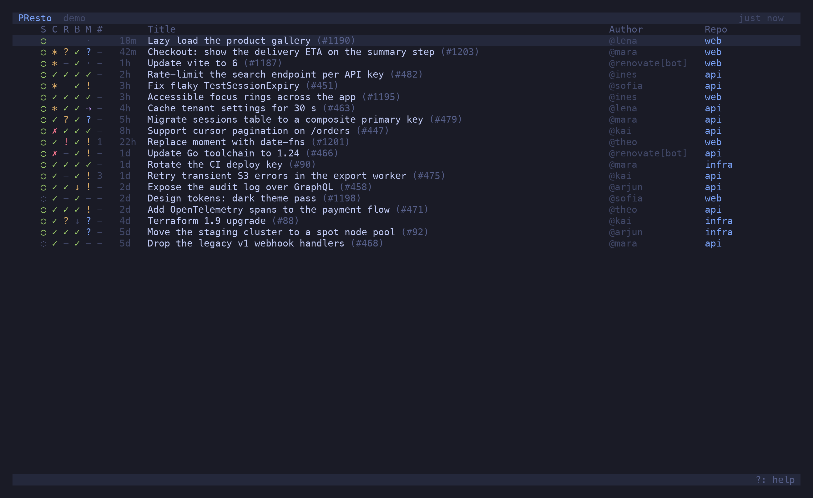
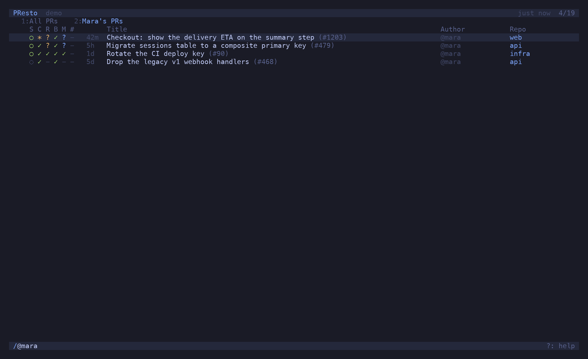
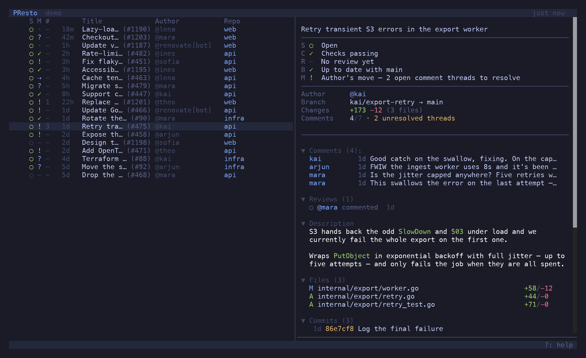
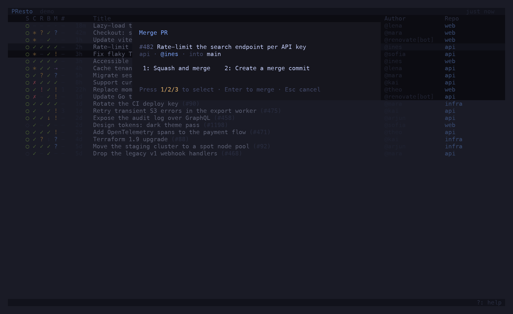
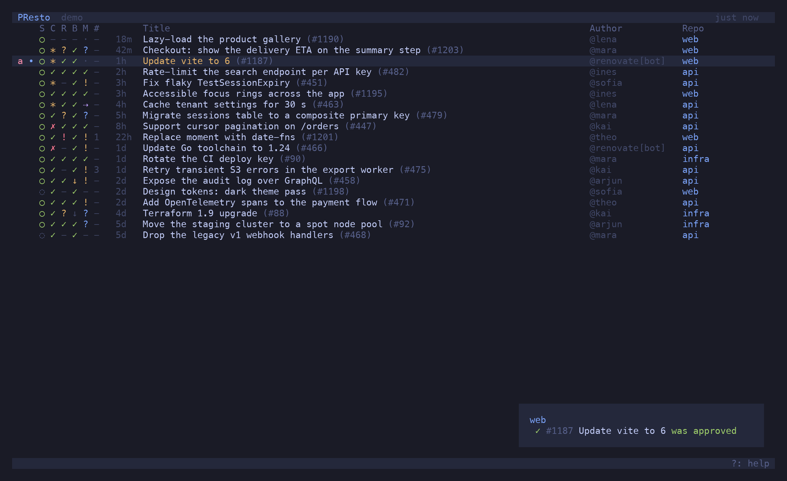

<p align="center">
  
</p>

<h1 align="center">presto</h1>

<p align="center">Every open PR across the repos you watch, in one list — and, for each one, whose move it is.</p>

<p align="center"><a href="https://candril.github.io/presto/"><strong>Documentation</strong></a> · <a href="https://candril.github.io/presto/guide/installation/">Install</a> · <a href="https://candril.github.io/presto/reference/key-bindings/">Key bindings</a> · <a href="https://candril.github.io/presto/reference/status-columns/">Status columns</a></p>

> [!CAUTION]
> **Spec-driven, AI-generated.** Every feature in presto starts as a numbered spec in [`specs/`](specs/), and the code and this documentation were generated from those specs with an AI pair. Use it with care: presto *writes* to GitHub — reviews, merges, auto-merge, branch updates, workflow runs. Start with `presto --demo`, then point it at repos you don't mind poking at.

```sh
brew install candril/tap/presto         # or: nix run github:candril/presto
presto --demo                           # the built-in demo — no GitHub, no config
```



---

### One list, whose move it is

A row carries five glyphs: **S**tate, **C**hecks, **R**eview, **B**ase, **M**erge. The first four are the gates; the last is the verdict — `✓` merge it, `!` the author's move, `?` someone else's, `·` a machine's, `⇢` auto-merge will land it. Not *blocked / pending / ready*: measured across real repos, that split put 86 % of PRs in "blocked" and told you nothing.



### One tab per question

`t` opens a new tab, `/` gives it a filter, and the name follows — *My PRs*, *Drafts*, *infra*, *Unread*. Every tab reads the same list, so five tabs cost one refresh; each keeps its own cursor; number keys switch; a dot means something in it changed. They are all there again on the next launch.



### The preview spells it out

`p` opens the same five columns with their meaning written out — *Author's move — 2 open comment threads to resolve* — then comments, reviews, the description as Markdown, files and commits.



### Act from the list

`^P` lists every action for the selected PR: review, merge, arm auto-merge, update the branch from base, re-run checks, trigger a workflow, checkout, open in riff or the browser. Rows update optimistically; a branch update shows `↻` until the next refresh proves it landed.



### Filter as you type, know what changed

`/` narrows the list live — `@me`, `repo:api`, `state:draft`, `>unread`, free text, or a pasted PR URL. Every refresh is diffed against the last: changed PRs get a dot and a toast.



## Install

```sh
brew install candril/tap/presto
```

```sh
nix run github:candril/presto              # try it; `nix profile install github:candril/presto` keeps it
```

```sh
curl -fsSL https://raw.githubusercontent.com/candril/presto/main/scripts/install.sh | bash
```

All three install the same binary — the one attached to the latest
[release](https://github.com/candril/presto/releases), verified against its `SHA256SUMS` — prebuilt
for macOS (Apple Silicon, Intel) and Linux (x64, arm64). The installer puts it in `/usr/local/bin`;
`PRESTO_INSTALL_DIR=~/.local/bin` moves it, `PRESTO_VERSION=0.1.0` pins it. Needs the [GitHub CLI](https://cli.github.com), logged in.

From source, with [Bun](https://bun.sh): `git clone https://github.com/candril/presto.git && cd presto && bun install && just install-bin`.

## Setup

Without a config presto shows the PRs of the repo in the current directory. To watch several, list them in `~/.config/presto/config.toml`:

```toml
[[repositories]]
name = "polaris/api"

[[repositories]]
name = "polaris/web"
starred_only = true    # only PRs from authors you have starred (s)
```

Every key, the filter grammar, the column legend and the full keymap are in the
**[docs](https://candril.github.io/presto/)**. Press `?` in the app for the keymap.

## The other terminal tools

presto is one of five, built the same way and installed the same way (`brew install candril/tap/<tool>`, `nix run github:candril/<tool>`, or the curl installer):

- [**lane**](https://candril.github.io/lane/) — Your Jira board, in the terminal. Read it, move it, and never touch the mouse.
- [**monq**](https://candril.github.io/monq/) — Browse, query, edit. MongoDB without leaving the terminal.
- [**riff**](https://candril.github.io/riff/) — Review the diff where you wrote it: PRs, branches and working-copy changes, with vim motions and inline comments.
- [**topiq**](https://candril.github.io/topiq/) — Peek, filter, replay. Kafka without leaving the terminal.

## Development

```sh
just dev          # run from source with hot reload
just demo         # the offline demo
just test         # bun test
just typecheck
just shots        # regenerate the docs screenshots from the demo (tmux + Pillow)
just demo-gif     # regenerate the README gif
just site-dev     # the docs site, locally
```

Features are specified before they are built — see [`specs/`](./specs). The demo (`--demo`, [spec 042](./specs/042-demo-mode.md)) is also where every screenshot comes from ([`docs/screenshots.md`](./docs/screenshots.md)).

## License

MIT

---

<p align="center"><sub>One of five terminal tools — one spec-first process, the same three installers:<br><a href="https://candril.github.io/lane/">lane</a> (Jira) · <a href="https://candril.github.io/monq/">monq</a> (MongoDB) · <a href="https://candril.github.io/presto/">presto</a> (pull requests) · <a href="https://candril.github.io/riff/">riff</a> (code review) · <a href="https://candril.github.io/topiq/">topiq</a> (Kafka)</sub></p>
