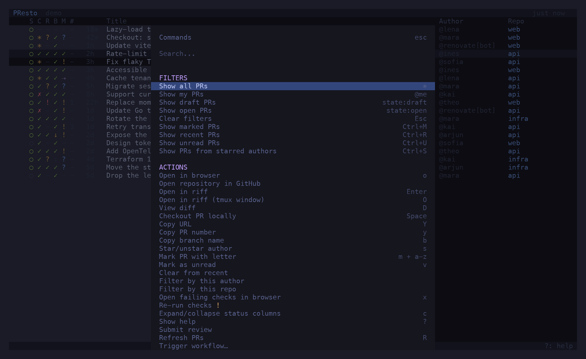
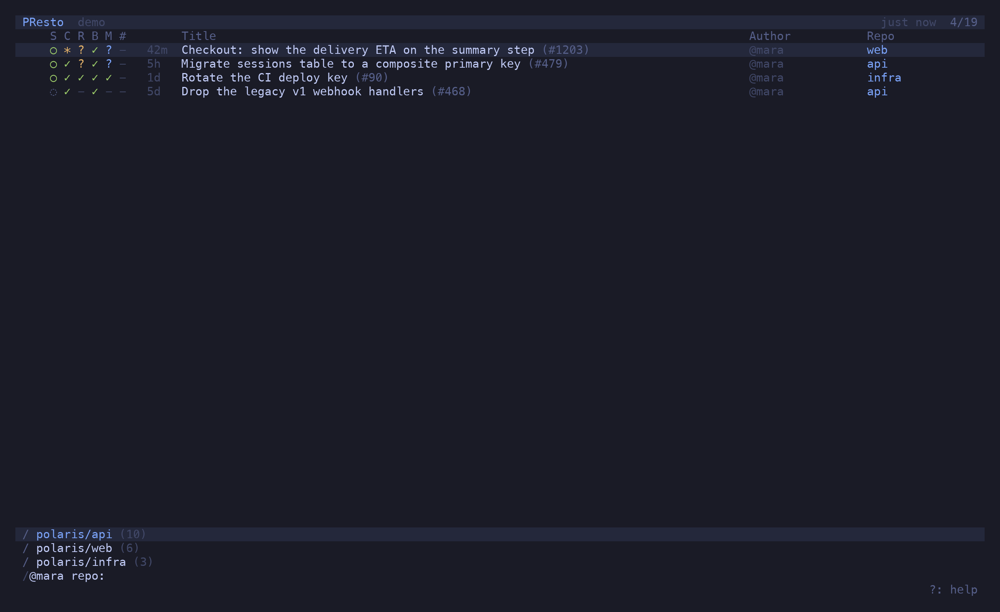

import { Aside } from '@astrojs/starlight/components'

<Aside type="caution">
**Spec-driven, AI-generated.** Every feature in presto starts as a numbered spec in [`specs/`](https://github.com/candril/presto/tree/main/specs), and the code and this documentation were generated from those specs with an AI pair. Use it with care: presto *writes* to GitHub — reviews, merges, auto-merge, branch updates, workflow runs. Start with `presto --demo`, then point it at repos you don't mind poking at.
</Aside>

```sh
brew install candril/tap/presto         # or: nix run github:candril/presto
presto --demo                           # the built-in demo — no GitHub, no config
```


## One list, whose move it is

A PR row carries five glyphs: **S**tate, **C**hecks, **R**eview, **B**ase and **M**erge. The
first four are the gates; the last one is the verdict — `✓` merge it, `!` the author's move,
`?` someone else's, `·` a machine's, `⇢` auto-merge will land it. Not *blocked / pending /
ready*: measured across real repos that put 86 % of PRs in "blocked" and told you nothing.


## One tab per question

`t` opens a new tab; `/` gives it a filter; the name follows — *My PRs*, *Drafts*, *infra*,
*Unread*. Every tab reads the same list, so five tabs cost one refresh, and each remembers its
own cursor. Number keys switch. A dot on a tab means something in it changed. All of it comes
back on the next launch.


## The preview spells it out

`p` opens the same five columns with their meaning written out — *Author's move — 2 open
comment threads to resolve* — then comments, reviews, the description as Markdown, files and
commits. `P` moves it to the bottom.


## Act from the list

`^P` lists every action for the selected PR with its shortcut: review, merge, arm auto-merge,
update the branch from base, re-run checks, trigger a workflow, checkout, open in riff or the
browser. A branch update shows `↻` until the next refresh proves it landed.




## Filter as you type

`/` narrows the list live: `@me`, `@theo`, `repo:api`, `state:draft`, `>unread`, `>marked`,
free text against the title, or paste a PR URL. Anything you type here can be a tab.



## Know what changed

Every refresh diffs against the last snapshot: a new push, a new comment, an approval, a merge.
Changed PRs get a dot and a toast; `>unread` lists them, `v` clears one.


## Try it

The demo ships in the binary: `presto --demo` opens a fictional org with three repos and enough
PRs to show every verdict. Everything works — approve, merge, update a branch — and is forgotten
on exit. It is also where every picture on this site comes from.
