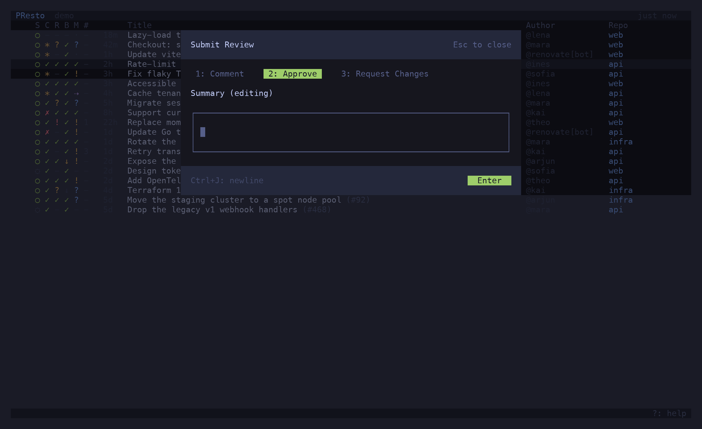
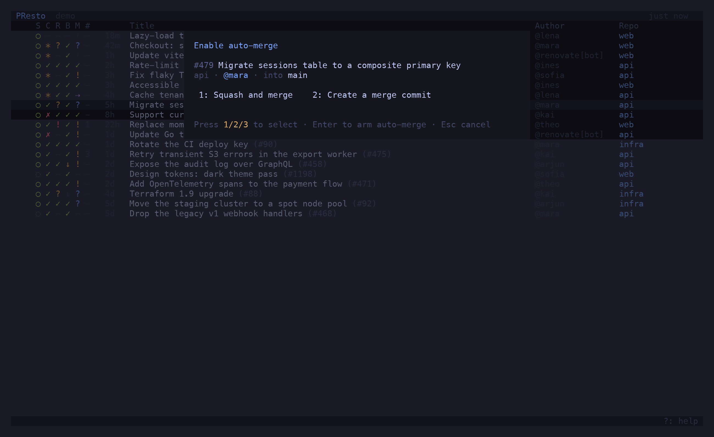
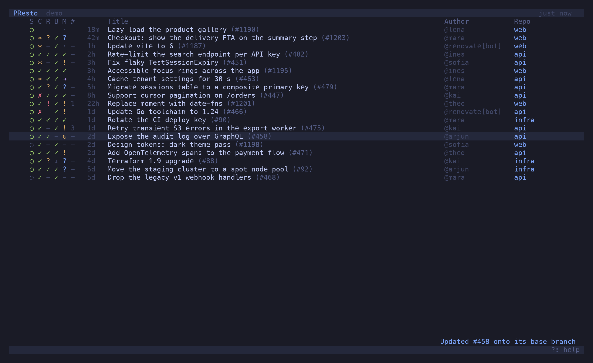
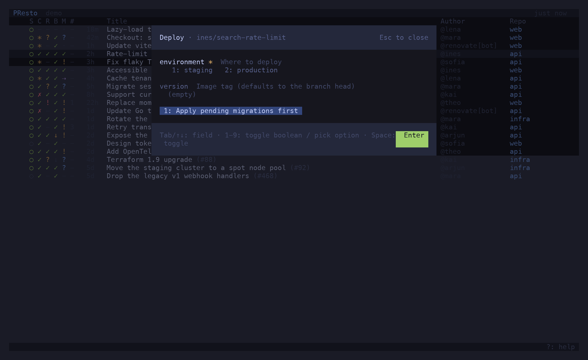

`^P` opens the command palette: every action available for the selected PR, plus filters and
column toggles, with its shortcut where it has one. Type to search, `↵` to run.

Actions that change a PR update the row **optimistically** and confirm on the next refresh.
Where GitHub refuses — approving your own PR, arming auto-merge on a PR that could merge right
now — the refusal is shown in the status line and the row is left alone.

## Merge

*Merge PR* fetches the repo's allowed methods and the PR's live merge state, then shows a
dialog: `1` squash, `2` merge commit, `3` rebase, whichever the repo allows.

The dialog gates on `mergeable_state`, not on the `mergeable` boolean: a PR can report
`mergeable: true`, be behind a strict base, and have its merge rejected. If the state it just
fetched is fresher than the row, the row is corrected on the spot.

## Review

*Submit review* opens a dialog: `1` comment, `2` approve, `3` request changes, and a body
(`^J` for a newline). The review is submitted against the PR's latest commit.

## Auto-merge

*Enable auto-merge* uses the same method picker and arms GitHub's "merge when ready". The row
shows `⇢` from then on. *Disable auto-merge* disarms it. GitHub refuses to arm it on a PR that
is already mergeable — merge that one instead.

## Update branch from base

*Update branch from base* (merge) and *… (rebase)* run `gh pr update-branch`. GitHub accepts
the request and applies it a moment later, so the row shows `↻` — *your branch update is still
landing* — until a refresh sees the new head commit, or two minutes pass.

## Checks

`x` — *Open failing checks* — opens whatever you actually need to look at: one red check opens
its job page; several open the PR's checks tab; none, but checks exist, opens the checks tab
anyway (re-run lives there); no checks at all opens the branch's workflow runs, because a PR
blocked on checks that never reported has an empty checks tab.

*Re-run checks* re-runs the failed jobs of every failed, timed-out or cancelled workflow run
on the head commit (a run that never started jobs is re-run in full). It spends real CI, so
it asks for a second `↵`.

## Trigger workflow

*Trigger workflow…* lists the repo's workflows that have a `workflow_dispatch` trigger, reads
the inputs off the YAML, and runs the one you pick against the PR's head branch. Inputs of
type `environment` cycle through the repo's environments; `choice` inputs through their
options.

Fork PRs cannot dispatch: `gh workflow run --ref` only sees branches on the base repo.

## State

*Mark as ready* / *Convert to draft*, *Close PR* (asks twice), *Reopen PR*.

## Hand-offs

| Action | Runs |
| --- | --- |
| `↵` Open in riff | `riff gh:owner/repo#N`, presto suspended until you quit riff, then refreshes |
| `⇧O` Open in riff (tmux window) | `tmux new-window riff …` — presto keeps running |
| `o` Open in browser | `gh pr view --web` |
| Open repository in GitHub | `gh repo view --web` |
| `⇧D` View diff | `gh pr diff --color=always` piped through `tools.diff` |
| `space` Checkout PR locally | `gh pr checkout` in the local clone — see [paths](/presto/reference/configuration/#paths) |
| `y` `⇧Y` `b` | copy the number, URL or branch to the clipboard |

## Columns

*Show / Hide … column* for each of state, checks, review, base sync, merge verdict, comments,
time, repository, author. Hidden columns stay hidden across launches. The gate columns also
collapse on their own when the list is too narrow to keep the title readable.
