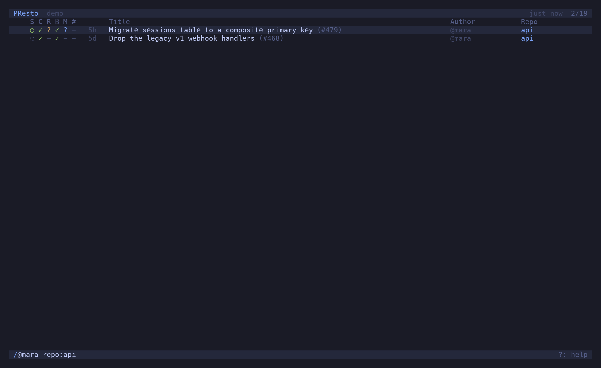

`/` opens the filter prompt. It narrows the list as you type, `tab` completes an author or repo
from the ones it has seen, `↵` keeps the filter, `esc` drops it. The active filter is shown in
the status bar; `⌫` clears it.


## The grammar

A query is a sequence of tokens. Tokens of the same kind **OR**, different kinds **AND**, and a
leading `-` negates.

| Token | Matches |
| --- | --- |
| `@login` | author — `@me` is you |
| `-@login` | not this author (`-@renovate[bot]`) |
| `repo:name` | repository, by substring of `owner/name` |
| `-repo:name` | not this repository |
| `state:open` / `draft` / `merged` / `closed` | state — `open` excludes drafts |
| `-state:draft` | not this state |
| `>unread` | PRs with changes you have not looked at |
| `>marked` | PRs with a mark letter |
| `marks:a` | PRs marked with that letter (`'a` types this for you) |
| `>recent` | PRs you opened recently |
| `>starred` | PRs by starred authors |
| `*` | show everything, including PRs hidden by `starred_only` repos |
| anything else | free text against the title |

Without a `state:` token the list shows open PRs and drafts only. Merged and closed PRs are
fetched on demand when you ask for them (`state:merged`), for the last 30 days.

```text
/ @me -state:draft
/ repo:api repo:web >unread
/ @theo state:merged
/ flaky test
```



## One PR

Paste a PR reference and the filter becomes a lookup:

```text
/ https://github.com/polaris/api/pull/482
/ polaris/api#482
/ api#482
/ #482                 searched across every configured repo
```

If the PR is not in the list — it is merged, or from a repo you don't watch — presto fetches
it. A repo you look into this way is remembered as *visited* and offered by `tab` completion
from then on; *Forget this repo* in the palette removes it.

## A branch

A single token containing a `/` is taken as a head branch name and looked up across the
configured repos:

```text
/ feature/OSA-1337-desktop-destroyer
```

## Starred-only repos

A repo with `starred_only = true` shows only PRs by authors you have starred (`s`). It is the
way to watch a busy repo for a few people. `*` in the filter lifts the restriction for a look.
