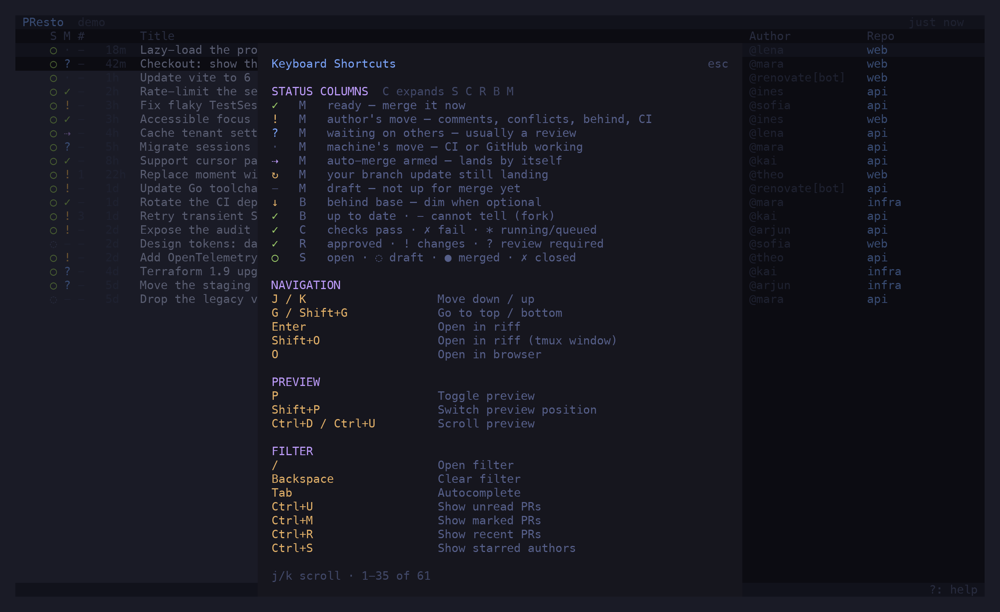

Every row carries five single-character columns. The first four are the **gates** GitHub
evaluates; the fifth is presto's **verdict** on them: whose move it is. `c` toggles between
the verdict alone and all five; `?` shows this legend in the app.

## S — State

| Glyph | Meaning |
| --- | --- |
| `○` green | open |
| `◌` dim | draft |
| `●` purple | merged |
| `✗` red | closed |

## C — Checks

| Glyph | Meaning |
| --- | --- |
| `✓` | every check passed (skipped, cancelled and neutral ones are ignored) |
| `✗` | a check failed, timed out, or failed to start |
| `*` | a check is running — or queued but not yet started |
| `-` | no checks on this commit |

GitHub's rollup only counts runs that have *started*, so a commit whose suites are all still
queued would otherwise look like a repo with no CI. presto reads the suites too and shows `*`
for "queued, nothing started yet".

## R — Review

| Glyph | Meaning |
| --- | --- |
| `✓` green | approved — GitHub's review decision |
| `✓` dim | approvals stand, but GitHub reports no decision (happens; the tick is the receipt) |
| `!` | changes requested |
| `?` | review required |
| `-` | no review yet |

Bots are not reviewers: an approval or a thread from `renovate[bot]`, Copilot or anything
matching `bot_patterns` does not count.

## B — Base

Where the head branch sits relative to its base — independent of the merge state, which folds
"behind" into "blocked" whenever both apply.

| Glyph | Meaning |
| --- | --- |
| `✓` | up to date with the base branch |
| `↓` yellow | behind, and the base branch **requires** PRs to be up to date — this blocks the merge |
| `↓` dim | behind, but updating is optional |
| `-` | cannot tell: a fork PR, or the REST fallback path |

Whether the base requires an update comes from the repo's rulesets (`rules/branches`), which
need only read access — classic branch protection needs admin rights and 404s for most people.

## M — Merge verdict

The single answer to *who is holding this up?* Deliberately not blocked / pending / ready:
measured across the configured repos, that split put 86 % of open PRs in "blocked" and made the
column a constant. Sorting by whose move it is spreads the same PRs across buckets that each
imply a different next step.

| Glyph | Verdict | When |
| --- | --- | --- |
| `✓` green | **ready** | merge state is clean or has hooks; or unstable (only a non-required check is red — GitHub offers the merge, the checks column carries the warning) |
| `⇢` purple | **auto-merge** | auto-merge is armed; it lands by itself when the gates clear |
| `!` yellow | **author's move** | anything only the author can clear, in this order: open comment threads · conflicts · behind a base that requires it · changes requested · failing checks · required checks that never started |
| `?` blue | **waiting on others** | a review is required; or reviewed, green and still blocked — something unnamed gates it (a required deployment, a CODEOWNER) |
| `·` dim | **machine's move** | checks are running, queued, or GitHub is still computing the merge state |
| `↻` yellow | **pending** | you fired a branch update and GitHub has not landed it yet; clears when a refresh shows a new head commit, or after two minutes |
| `-` dim | **draft** | not up for merge, so no verdict — nothing GitHub reports about a draft is trustworthy enough to build one on |

Two rules worth knowing:

- **Open threads outrank everything.** Many teams block by *commenting* rather than by
  requesting changes, so GitHub reports "review required" (or even "clean") on a PR whose
  reviewer is in fact waiting on the author. An unresolved thread is the author's move, and
  only once every thread is resolved does an unapproved PR go back to waiting for a review.
- **A review outranks running CI.** The review is the bottleneck a human can clear now; CI
  finishes on its own either way.

## In the preview

The preview header repeats the five columns with their meaning written out — *Author's move —
2 open comment threads to resolve* — derived from the same PR object the row renders, so the
two can never disagree.

## The comment column

`#` counts comments that are still **open**: those inside unresolved review threads. A PR with
twelve comments of which ten are settled reads as `2`; conversation comments and review bodies
cannot be resolved and are not counted. The preview shows `settled/total`.
