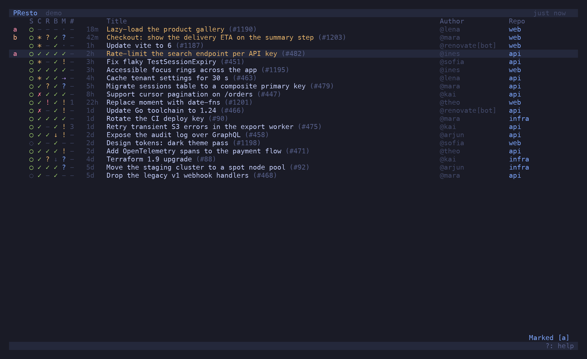

## Tabs

A tab is a filter with a name. `t` duplicates the current tab; change its filter and the name
follows: `@me` becomes *My PRs*, `repo:api state:draft` becomes *api · Drafts*, `>starred`
becomes *Starred*. *Rename tab* in the palette sets your own. `[` `]` and `1`–`9` switch, `d`
closes, `u` brings the last one back. Tabs are saved to `tabs.json` and restored on launch.

Every tab shares one PR list underneath, so switching is instant. A tab shows a dot when any
PR it would list has unread changes.

## Marks

`m` then a letter marks the selected PR with it; the letter appears in the first column in a
colour fixed per letter, and the title turns gold. The same letter again unmarks. `'` then the
letter filters to that mark (`'a` is `marks:a`); `''` clears; `>marked` shows every marked PR.

Marks are the way to keep a hand-picked set: "the three I need to land this week" as `w`,
"waiting on someone" as `z`. Marked PRs are fetched on every refresh even after they leave the
open list, so a merged one is still there under `'w`.

## Unread

Every refresh compares each PR to the snapshot from the last one. A difference — new commits,
new comments, an approval, changes requested, merged, closed, reopened, ready, draft, checks
passed or failed — marks the PR unread: a blue dot in front of the row, a toast at the bottom,
and the changes listed in the preview.

A PR is marked read when you open it (`↵`, `o`, `p`) or move off it with the preview open; `v`
toggles it by hand. `>unread` (`^U`) lists what is still unread. With
`notifications.desktop = true` the toast is also sent as a system notification (macOS:
`terminal-notifier` if installed, else `osascript`; Linux: `notify-send`).

## Stars and recent

`s` stars the selected PR's author. Starred authors are offered first by `tab` completion,
`>starred` (`^S`) lists their PRs, and a repo with `starred_only = true` shows nobody else.

PRs you open are remembered; `>recent` (`^R`) lists the last thirty, fetching the ones that
have since merged.
